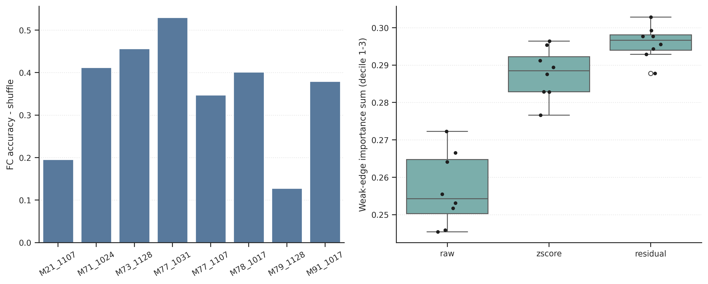
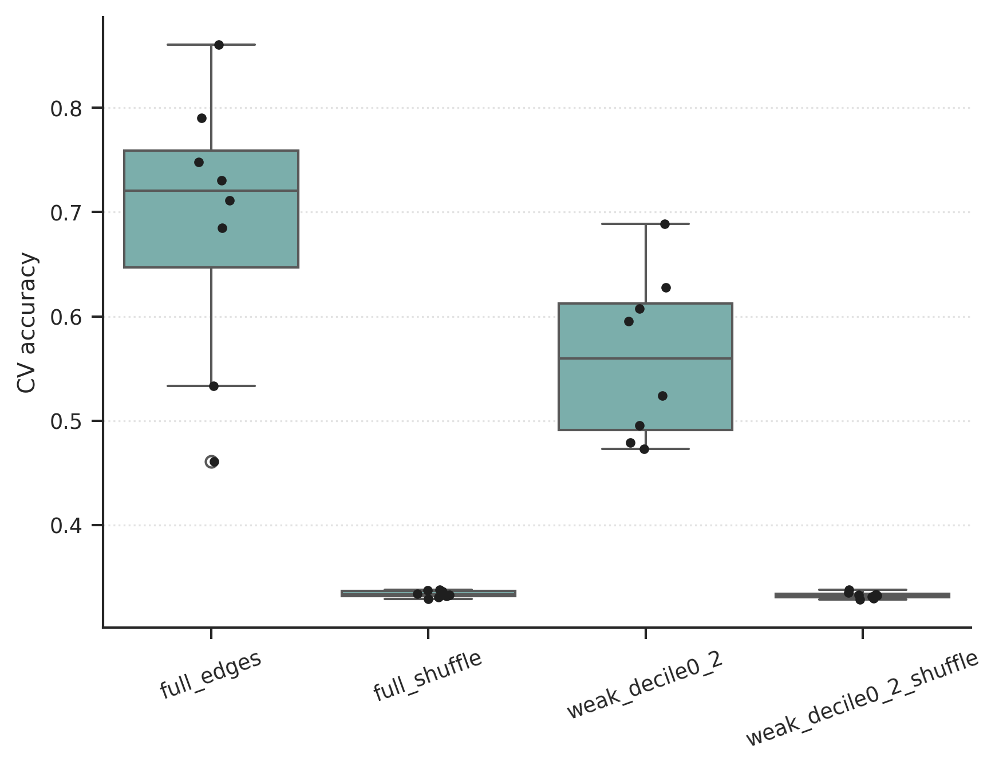

# Group FC Decoder Focus Report

Number of mice: 8

## Decoder summary

| mouse_id   |   window_start |   window_end |   n_trials |   n_neurons_used | neuron_mode   |   n_features_fc |   n_components_svd |   n_splits |   accuracy_mean |   accuracy_std |   shuffle_accuracy_mean |   shuffle_accuracy_std |   accuracy_minus_shuffle |   recall_Divergent |   recall_Convergent |   recall_Random |
|:-----------|---------------:|-------------:|-----------:|-----------------:|:--------------|----------------:|-------------------:|-----------:|----------------:|---------------:|------------------------:|-----------------------:|-------------------------:|-------------------:|--------------------:|----------------:|
| M21_1107   |             10 |           30 |        105 |              191 | rr_union      |           18145 |                 40 |          3 |        0.533333 |      0.0719032 |                0.338095 |              0.0235619 |                 0.195238 |          0.0571429 |            0.628571 |        0.914286 |
| M71_1024   |             10 |           30 |        135 |              226 | rr_union      |           25425 |                 40 |          3 |        0.748148 |      0.0559247 |                0.336296 |              0.0229015 |                 0.411852 |          0.466667  |            0.844444 |        0.933333 |
| M73_1128   |             10 |           30 |        105 |              513 | rr_union      |          131328 |                 40 |          3 |        0.790476 |      0.0824786 |                0.333968 |              0.0253749 |                 0.456508 |          0.742857  |            1        |        0.628571 |
| M77_1031   |             10 |           30 |        129 |              711 | rr_union      |          252405 |                 40 |          3 |        0.860465 |      0.0697674 |                0.331008 |              0.0179966 |                 0.529457 |          0.72093   |            0.906977 |        0.953488 |
| M77_1107   |             10 |           30 |        165 |              173 | rr_union      |           14878 |                 40 |          3 |        0.684848 |      0.0277732 |                0.337576 |              0.0266396 |                 0.347273 |          0.218182  |            0.927273 |        0.909091 |
| M78_1017   |             10 |           30 |        126 |              726 | rr_union      |          263175 |                 40 |          3 |        0.730159 |      0.0727393 |                0.328836 |              0.0298186 |                 0.401323 |          0.857143  |            0.714286 |        0.619048 |
| M79_1128   |             10 |           30 |        165 |              365 | rr_union      |           66430 |                 40 |          3 |        0.460606 |      0.0209946 |                0.333131 |              0.02374   |                 0.127475 |          0.327273  |            0.636364 |        0.418182 |
| M91_1017   |             10 |           30 |        135 |              235 | rr_union      |           27495 |                 40 |          3 |        0.711111 |      0.03849   |                0.331852 |              0.0394561 |                 0.379259 |          0.844444  |            0.333333 |        0.955556 |

## Weak-edge summary by score

| mouse_id   | score_type   |   weak_importance_sum_decile123 |   strong_importance_sum_decile8910 |   weak_minus_strong |
|:-----------|:-------------|--------------------------------:|-----------------------------------:|--------------------:|
| M21_1107   | raw          |                        0.255483 |                           0.345797 |         -0.0903139  |
| M21_1107   | zscore       |                        0.289386 |                           0.310229 |         -0.0208425  |
| M21_1107   | residual     |                        0.297693 |                           0.3026   |         -0.00490645 |
| M71_1024   | raw          |                        0.245411 |                           0.377686 |         -0.132275   |
| M71_1024   | zscore       |                        0.282832 |                           0.328457 |         -0.045625   |
| M71_1024   | residual     |                        0.297698 |                           0.310822 |         -0.0131247  |
| M73_1128   | raw          |                        0.253111 |                           0.354747 |         -0.101635   |
| M73_1128   | zscore       |                        0.287547 |                           0.316264 |         -0.0287168  |
| M73_1128   | residual     |                        0.29434  |                           0.309528 |         -0.0151878  |
| M77_1031   | raw          |                        0.245868 |                           0.361223 |         -0.115355   |
| M77_1031   | zscore       |                        0.276591 |                           0.328468 |         -0.0518777  |
| M77_1031   | residual     |                        0.28777  |                           0.317531 |         -0.0297606  |
| M77_1107   | raw          |                        0.264134 |                           0.334715 |         -0.0705805  |
| M77_1107   | zscore       |                        0.295375 |                           0.30155  |         -0.00617436 |
| M77_1107   | residual     |                        0.299232 |                           0.297791 |          0.00144156 |
| M78_1017   | raw          |                        0.251727 |                           0.356903 |         -0.105177   |
| M78_1017   | zscore       |                        0.282883 |                           0.322886 |         -0.0400029  |
| M78_1017   | residual     |                        0.295553 |                           0.310415 |         -0.0148619  |
| M79_1128   | raw          |                        0.266559 |                           0.33314  |         -0.0665807  |
| M79_1128   | zscore       |                        0.291172 |                           0.307828 |         -0.0166555  |
| M79_1128   | residual     |                        0.292857 |                           0.306207 |         -0.0133494  |
| M91_1017   | raw          |                        0.272257 |                           0.328839 |         -0.0565824  |
| M91_1017   | zscore       |                        0.296425 |                           0.303476 |         -0.00705143 |
| M91_1017   | residual     |                        0.302832 |                           0.297244 |          0.00558782 |

## Decoder using decile0-2 edges only

| mouse_id   | subset_name          | subset_desc                      |   subset_decile0_min |   subset_decile0_max |   n_edges_subset |   edge_fraction_subset |   full_n_edges |   full_accuracy_mean |   full_accuracy_std |   full_shuffle_accuracy_mean |   full_shuffle_accuracy_std |   full_accuracy_minus_shuffle |   subset_n_components_svd |   subset_accuracy_mean |   subset_accuracy_std |   subset_shuffle_accuracy_mean |   subset_shuffle_accuracy_std |   subset_accuracy_minus_shuffle |   subset_minus_full_accuracy |   subset_minus_full_delta |
|:-----------|:---------------------|:---------------------------------|---------------------:|---------------------:|-----------------:|-----------------------:|---------------:|---------------------:|--------------------:|-----------------------------:|----------------------------:|------------------------------:|--------------------------:|-----------------------:|----------------------:|-------------------------------:|------------------------------:|--------------------------------:|-----------------------------:|--------------------------:|
| M21_1107   | decile0_2_zero_based | weakest 30% edges by |mean corr| |                    0 |                    2 |             5444 |               0.300028 |          18145 |             0.533333 |           0.0719032 |                     0.338095 |                   0.0235619 |                      0.195238 |                        40 |               0.52381  |             0.0329914 |                       0.338095 |                     0.0429392 |                        0.185714 |                  -0.00952381 |               -0.00952381 |
| M71_1024   | decile0_2_zero_based | weakest 30% edges by |mean corr| |                    0 |                    2 |             7628 |               0.30002  |          25425 |             0.748148 |           0.0559247 |                     0.336296 |                   0.0229015 |                      0.411852 |                        40 |               0.688889 |             0.155556  |                       0.333086 |                     0.0375939 |                        0.355802 |                  -0.0592593  |               -0.0560494  |
| M73_1128   | decile0_2_zero_based | weakest 30% edges by |mean corr| |                    0 |                    2 |            39399 |               0.300005 |         131328 |             0.790476 |           0.0824786 |                     0.333968 |                   0.0253749 |                      0.456508 |                        40 |               0.495238 |             0.0719032 |                       0.329841 |                     0.0227148 |                        0.165397 |                  -0.295238   |               -0.291111   |
| M77_1031   | decile0_2_zero_based | weakest 30% edges by |mean corr| |                    0 |                    2 |            75722 |               0.300002 |         252405 |             0.860465 |           0.0697674 |                     0.331008 |                   0.0179966 |                      0.529457 |                        40 |               0.627907 |             0.190357  |                       0.333592 |                     0.0279488 |                        0.294315 |                  -0.232558   |               -0.235142   |
| M77_1107   | decile0_2_zero_based | weakest 30% edges by |mean corr| |                    0 |                    2 |             4464 |               0.30004  |          14878 |             0.684848 |           0.0277732 |                     0.337576 |                   0.0266396 |                      0.347273 |                        40 |               0.472727 |             0.0629837 |                       0.332525 |                     0.0389447 |                        0.140202 |                  -0.212121   |               -0.207071   |
| M78_1017   | decile0_2_zero_based | weakest 30% edges by |mean corr| |                    0 |                    2 |            78953 |               0.300002 |         263175 |             0.730159 |           0.0727393 |                     0.328836 |                   0.0298186 |                      0.401323 |                        40 |               0.595238 |             0.144828  |                       0.335185 |                     0.0224172 |                        0.260053 |                  -0.134921   |               -0.14127    |
| M79_1128   | decile0_2_zero_based | weakest 30% edges by |mean corr| |                    0 |                    2 |            19929 |               0.3      |          66430 |             0.460606 |           0.0209946 |                     0.333131 |                   0.02374   |                      0.127475 |                        40 |               0.478788 |             0.0584464 |                       0.328485 |                     0.0383439 |                        0.150303 |                   0.0181818  |                0.0228283  |
| M91_1017   | decile0_2_zero_based | weakest 30% edges by |mean corr| |                    0 |                    2 |             8249 |               0.300018 |          27495 |             0.711111 |           0.03849   |                     0.331852 |                   0.0394561 |                      0.379259 |                        40 |               0.607407 |             0.06789   |                       0.331358 |                     0.0362853 |                        0.276049 |                  -0.103704   |               -0.10321    |

## Group weak-edge aggregate

| score_type   |   weak_importance_mean |   weak_importance_std |   n_mice |
|:-------------|-----------------------:|----------------------:|---------:|
| raw          |               0.256819 |            0.00984338 |        8 |
| residual     |               0.295997 |            0.00452674 |        8 |
| zscore       |               0.287776 |            0.00676367 |        8 |

## Figure

