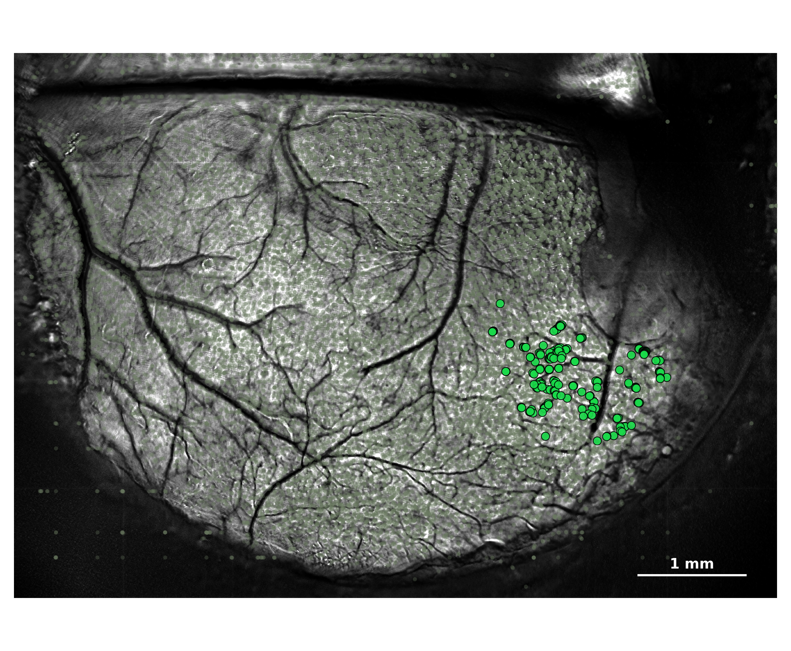
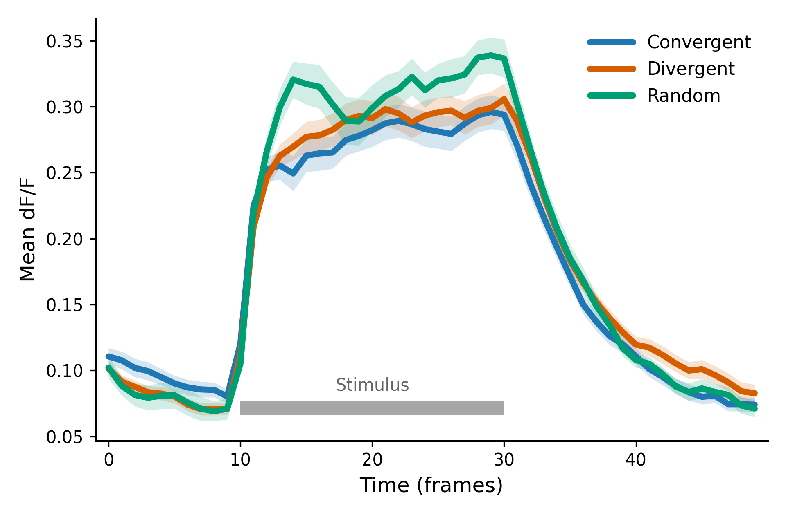
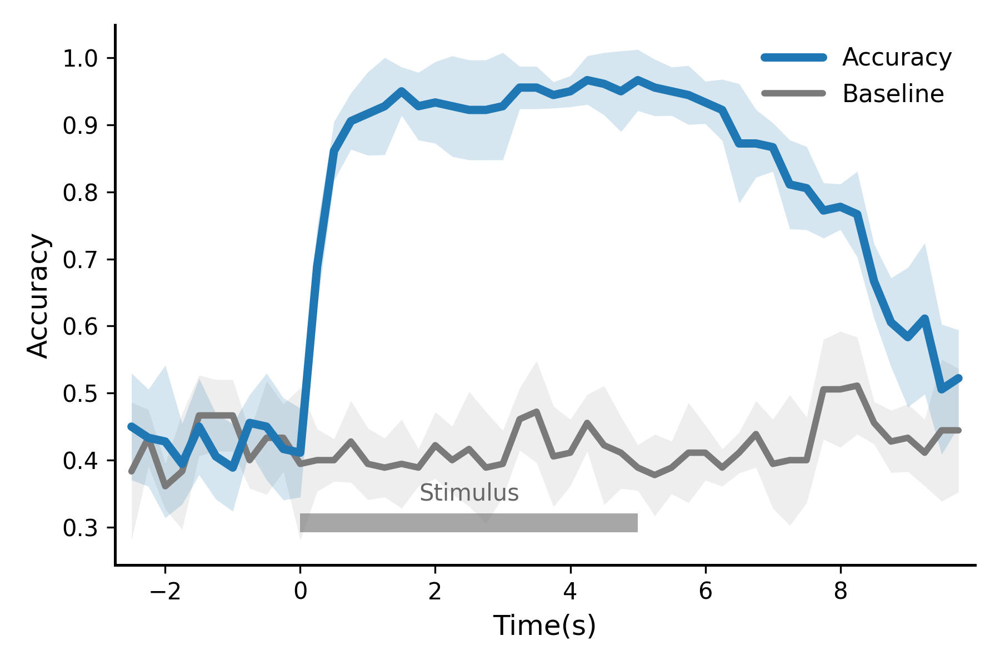
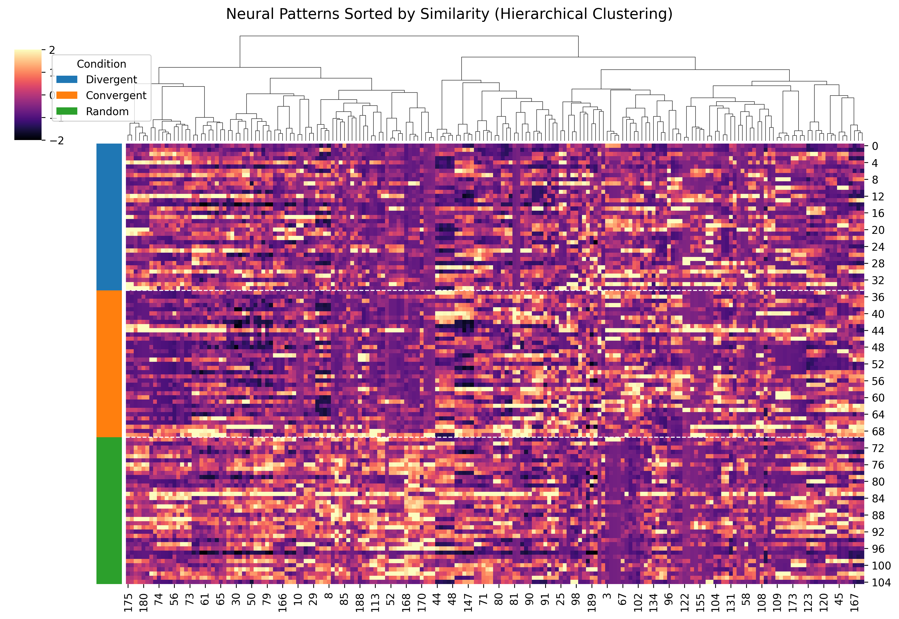
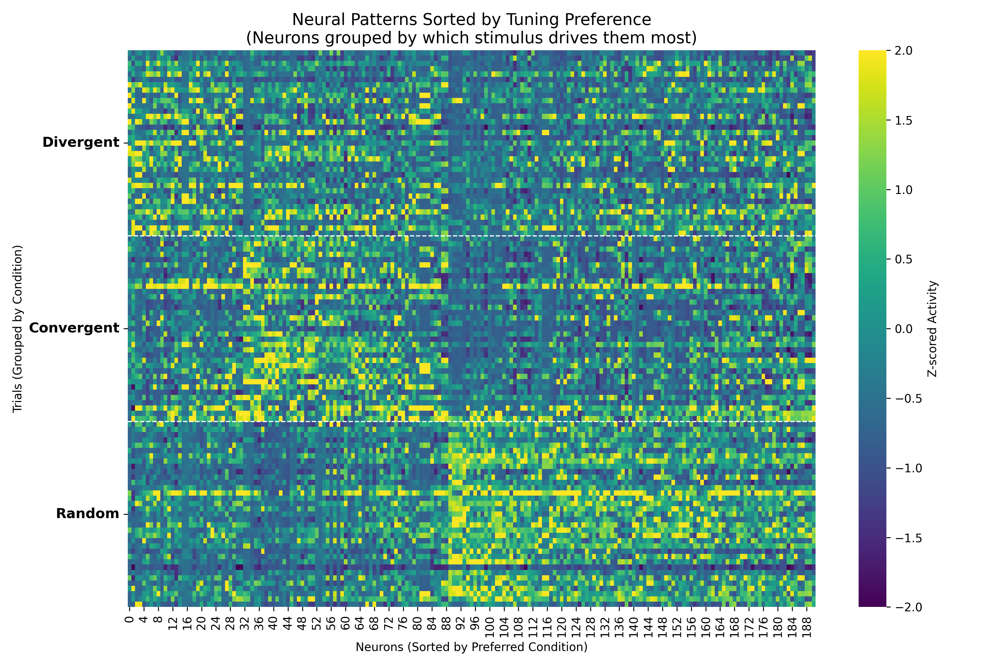
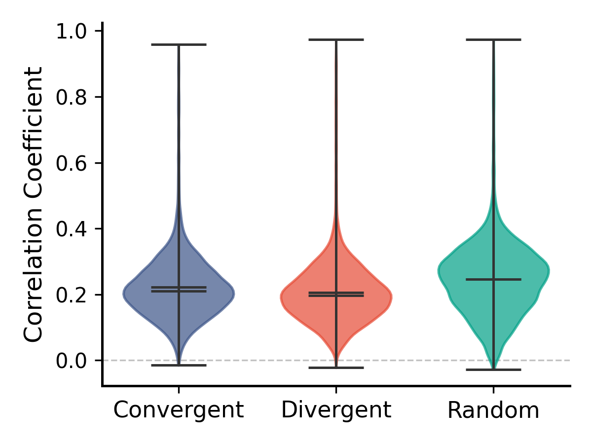
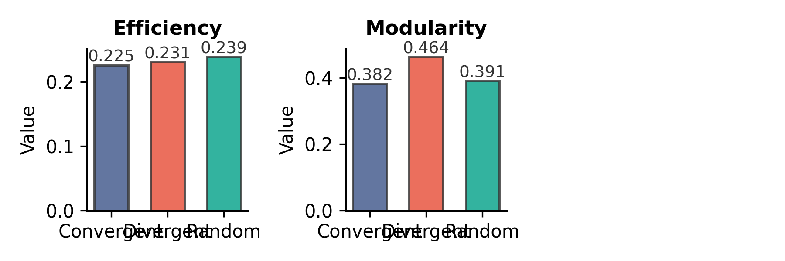

# 小鼠 M21_1107 综合数据分析报告

## 1. 基础元数据
- **原始数据源**: `/beegfs_hdd/data/nfs_share/users/guiyun/nishome/Micedata/M21_1107`
- **分析生成时间**: `2026-03-06 15:43:12`
- **数据导出目录**: `[../results/M21_1107/data/](./data/)` (包含CSV与JSON)
- **图表导出目录**: `[../results/M21_1107/figures/](./figures/)`

---

## 2. 关键结果数据表

### 2.1 网络拓扑核心指标 (Network Metrics)
以下为不同刺激条件下的图论特征统计（详见 `[data/M21_1107_network_metrics.csv](./data/M21_1107_network_metrics.csv)`）：

|   Class_ID |   n_nodes |   n_edges |   density |   mean_degree |   largest_component |   avg_clustering |   global_efficiency |   local_efficiency |   transitivity |   efficiency |   modularity |   betweenness_mean |
|-----------:|----------:|----------:|----------:|--------------:|--------------------:|-----------------:|--------------------:|-------------------:|---------------:|-------------:|-------------:|-------------------:|
|          1 |       191 |       907 |      0.05 |        9.4974 |                 137 |           0.6154 |              0.2255 |             0.6861 |         0.4941 |       0.2255 |       0.3821 |             0.0046 |
|          2 |       191 |       907 |      0.05 |        9.4974 |                 142 |           0.6313 |              0.2306 |             0.7151 |         0.51   |       0.2306 |       0.4636 |             0.0055 |
|          3 |       191 |       907 |      0.05 |        9.4974 |                 141 |           0.5651 |              0.2386 |             0.6451 |         0.4366 |       0.2386 |       0.3908 |             0.005  |

### 2.2 RR 神经元与解码数据
* **RR 神经元索引**: 已将不同类别的响应神经元原位索引导出至 `[JSON文件](../results/M21_1107/data/M21_1107_rr_neurons_indices.json)`，可用于后续特征追踪。
* **时间窗解码准确率**: 各时间点的分类表现及打乱基线数据已导出至 `[CSV文件](../results/M21_1107/data/M21_1107_decoding_accuracy.csv)`。

---

## 3. 核心可视化图表
*(注：以下图片链接指向本地 `./figures/` 目录。必须在上方对应的绘图函数中添加 `fig.savefig()` 以生成这些文件)*

### 3.1 RR 神经元空间分布

### 3.2 群体平均响应时间序列 (Population Average)

### 3.3 动态分类准确率 (Decoding Accuracy)

[0.45       0.43333333 0.42777778 0.39444444 0.45       0.40555556
 0.38888889 0.45555556 0.45       0.41666667 0.41111111 0.68888889
 0.86111111 0.90555556 0.91666667 0.92777778 0.95       0.92777778
 0.93333333 0.92777778 0.92222222 0.92222222 0.92777778 0.95555556
 0.95555556 0.94444444 0.95       0.96666667 0.96111111 0.95
 0.96666667 0.95555556 0.95       0.94444444 0.93333333 0.92222222
 0.87222222 0.87222222 0.86666667 0.81111111 0.80555556 0.77222222
 0.77777778 0.76666667 0.66666667 0.60555556 0.58333333 0.61111111
 0.50555556 0.52222222]
[0.07954345 0.07243558 0.11385501 0.06022079 0.071901   0.06394925
 0.06514466 0.04212709 0.07954345 0.07607258 0.06631854 0.06022079
 0.04392052 0.04212709 0.062113   0.07243558 0.03621779 0.05046084
 0.06085806 0.07505142 0.0745356  0.0745356  0.080027   0.03167154
 0.03167154 0.01964186 0.02324056 0.03621779 0.04648111 0.06022079
 0.04564355 0.04212709 0.03621779 0.04392052 0.03167154 0.04564355
 0.08914893 0.05046084 0.03621779 0.06631854 0.062113   0.0412011
 0.03402069 0.06394925 0.05555556 0.06631854 0.10393493 0.11283387
 0.09702361 0.071901  ]

### 3.4 神经元活动响应聚类 (Clustermap)

### 3.5 变量相关性与网络指标提琴图 (Violin/Bars)

