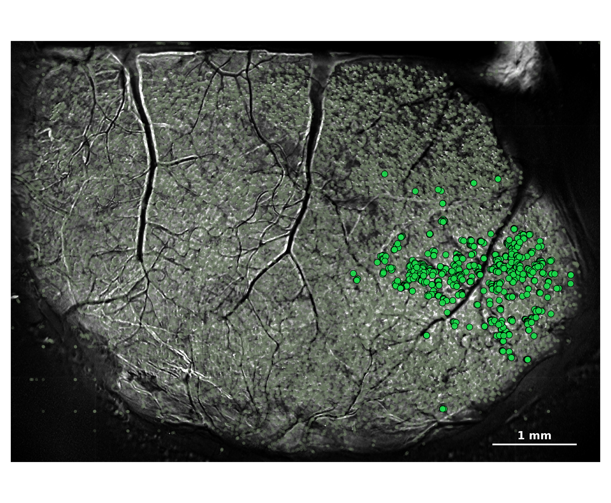
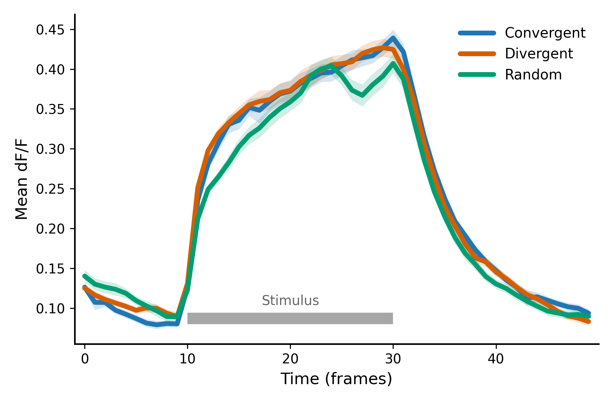
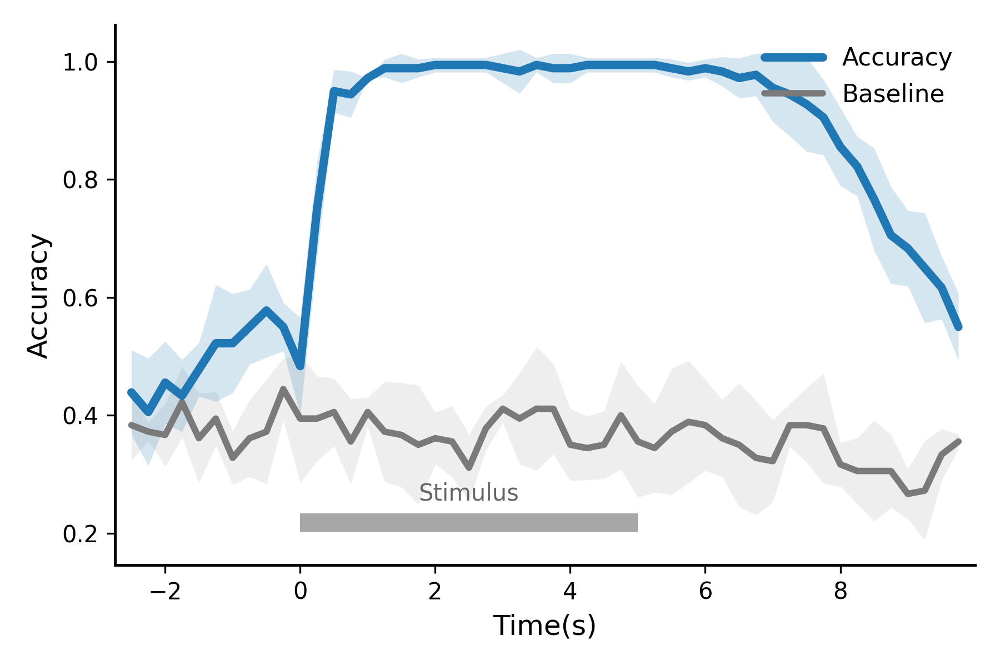
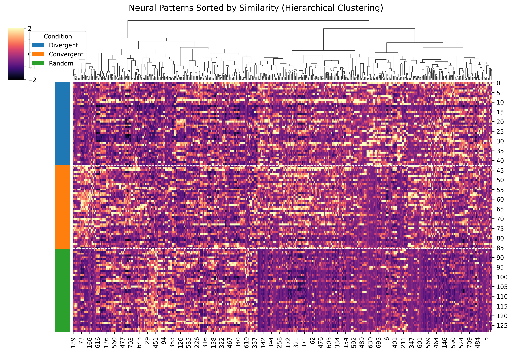
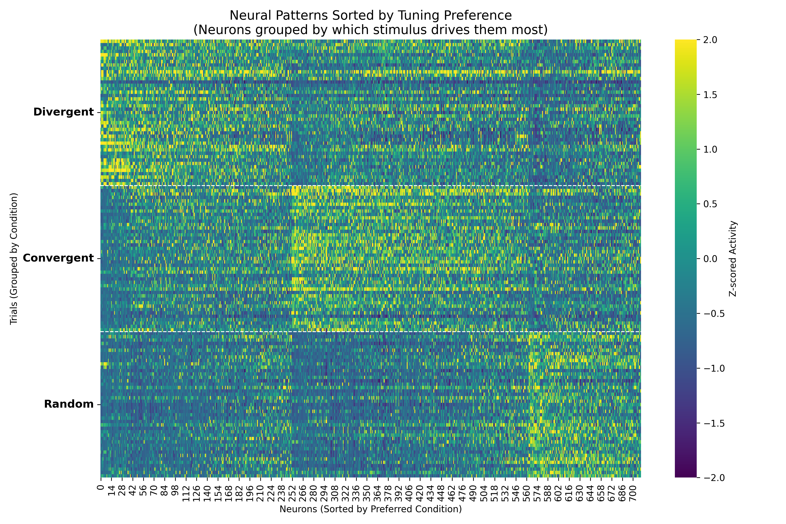
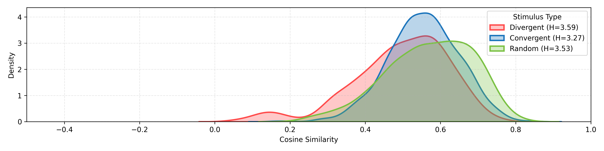
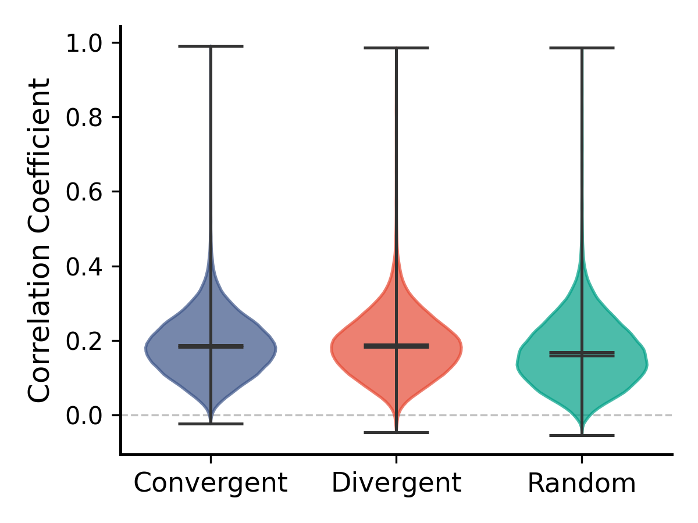
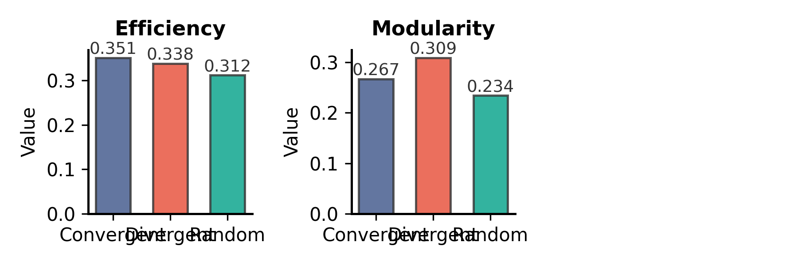

# 小鼠 M77_1031 综合数据分析报告

## 1. 基础元数据
- **原始数据源**: `/beegfs_hdd/data/nfs_share/users/guiyun/nishome/Micedata/M77_1031`
- **分析生成时间**: `2026-03-06 16:01:41`
- **数据导出目录**: `[../results/M77_1031/data/](./data/)` (包含CSV与JSON)
- **图表导出目录**: `[../results/M77_1031/figures/](./figures/)`

---

## 2. 关键结果数据表

### 2.1 网络拓扑核心指标 (Network Metrics)
以下为不同刺激条件下的图论特征统计（详见 `[data/M77_1031_network_metrics.csv](./data/M77_1031_network_metrics.csv)`）：

|   Class_ID |   n_nodes |   n_edges |   density |   mean_degree |   largest_component |   avg_clustering |   global_efficiency |   local_efficiency |   transitivity |   efficiency |   modularity |   betweenness_mean |
|-----------:|----------:|----------:|----------:|--------------:|--------------------:|-----------------:|--------------------:|-------------------:|---------------:|-------------:|-------------:|-------------------:|
|          1 |       711 |     12620 |      0.05 |       35.4993 |                 648 |           0.6318 |              0.3515 |             0.7746 |         0.4457 |       0.3515 |       0.2669 |             0.002  |
|          2 |       711 |     12620 |      0.05 |       35.4993 |                 635 |           0.6615 |              0.3381 |             0.787  |         0.4391 |       0.3381 |       0.3091 |             0.0019 |
|          3 |       711 |     12620 |      0.05 |       35.4993 |                 602 |           0.6397 |              0.312  |             0.7618 |         0.4467 |       0.312  |       0.2341 |             0.0016 |

### 2.2 RR 神经元与解码数据
* **RR 神经元索引**: 已将不同类别的响应神经元原位索引导出至 `[JSON文件](../results/M77_1031/data/M77_1031_rr_neurons_indices.json)`，可用于后续特征追踪。
* **时间窗解码准确率**: 各时间点的分类表现及打乱基线数据已导出至 `[CSV文件](../results/M77_1031/data/M77_1031_decoding_accuracy.csv)`。

---

## 3. 核心可视化图表
*(注：以下图片链接指向本地 `./figures/` 目录。必须在上方对应的绘图函数中添加 `fig.savefig()` 以生成这些文件)*

### 3.1 RR 神经元空间分布

### 3.2 群体平均响应时间序列 (Population Average)

### 3.3 动态分类准确率 (Decoding Accuracy)

[0.43888889 0.40555556 0.45555556 0.43333333 0.47777778 0.52222222
 0.52222222 0.55       0.57777778 0.55       0.48333333 0.75
 0.95       0.94444444 0.97222222 0.98888889 0.98888889 0.98888889
 0.99444444 0.99444444 0.99444444 0.99444444 0.98888889 0.98333333
 0.99444444 0.98888889 0.98888889 0.99444444 0.99444444 0.99444444
 0.99444444 0.99444444 0.98888889 0.98333333 0.98888889 0.98333333
 0.97222222 0.97777778 0.95555556 0.94444444 0.92777778 0.90555556
 0.85555556 0.82222222 0.76666667 0.70555556 0.68333333 0.65
 0.61666667 0.55      ]
[7.19009950e-02 9.12870929e-02 6.97216689e-02 6.08580619e-02
 4.56435465e-02 9.89918316e-02 8.42541716e-02 6.33430792e-02
 7.95434504e-02 4.12011027e-02 8.24022054e-02 8.09854430e-02
 3.62177911e-02 3.92837101e-02 1.24126708e-16 1.52145155e-02
 2.48451997e-02 1.52145155e-02 1.24225999e-02 1.24225999e-02
 1.24225999e-02 1.24225999e-02 2.48451997e-02 3.72677996e-02
 1.24225999e-02 2.48451997e-02 2.48451997e-02 1.24225999e-02
 1.24225999e-02 1.24225999e-02 1.24225999e-02 1.24225999e-02
 1.52145155e-02 1.52145155e-02 1.52145155e-02 2.48451997e-02
 3.40206909e-02 3.62177911e-02 5.76012260e-02 7.08197155e-02
 8.00270016e-02 6.39492469e-02 6.63185355e-02 5.04608392e-02
 8.69581991e-02 8.24022054e-02 6.39492469e-02 9.33763129e-02
 5.34316224e-02 5.69275043e-02]

### 3.4 神经元活动响应聚类 (Clustermap)

   

### 3.5 变量相关性与网络指标提琴图 (Violin/Bars)

