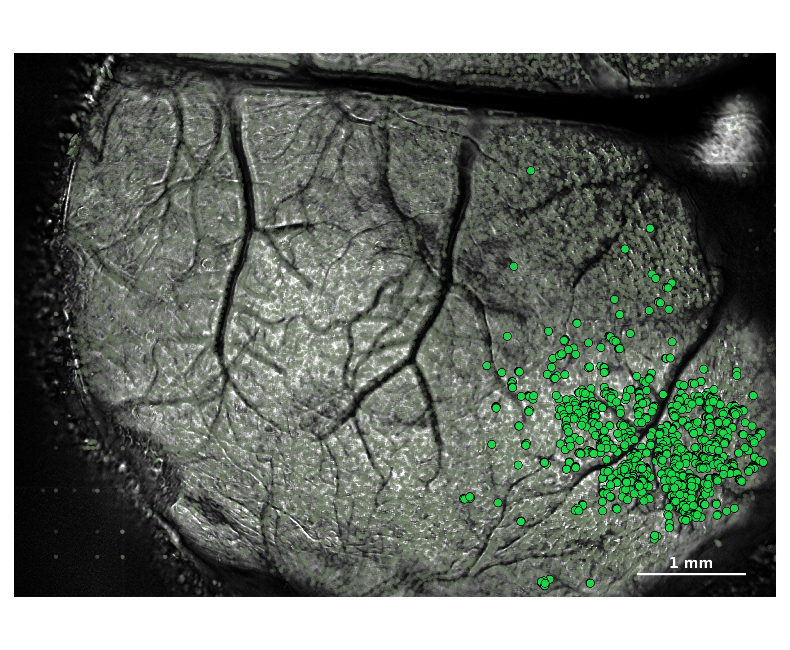
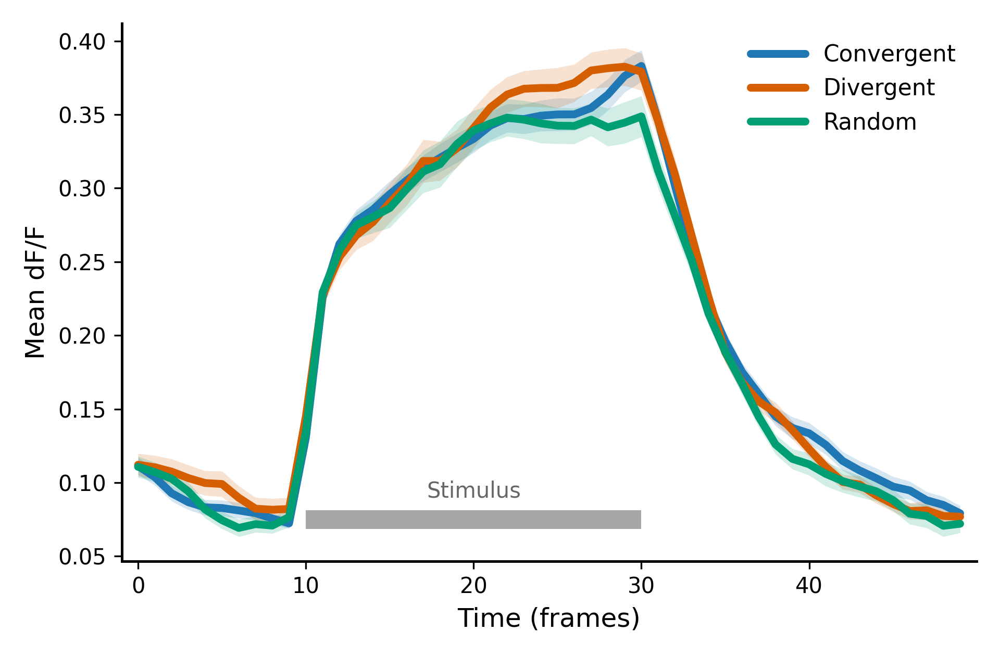
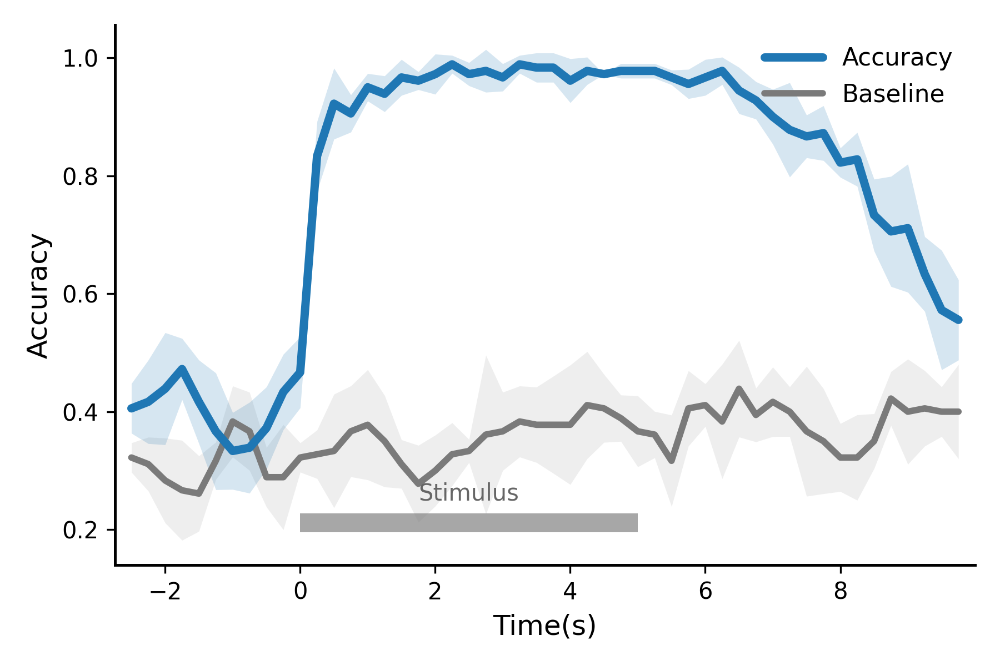
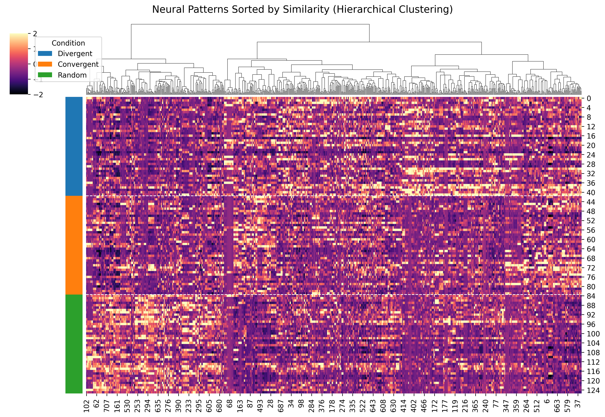
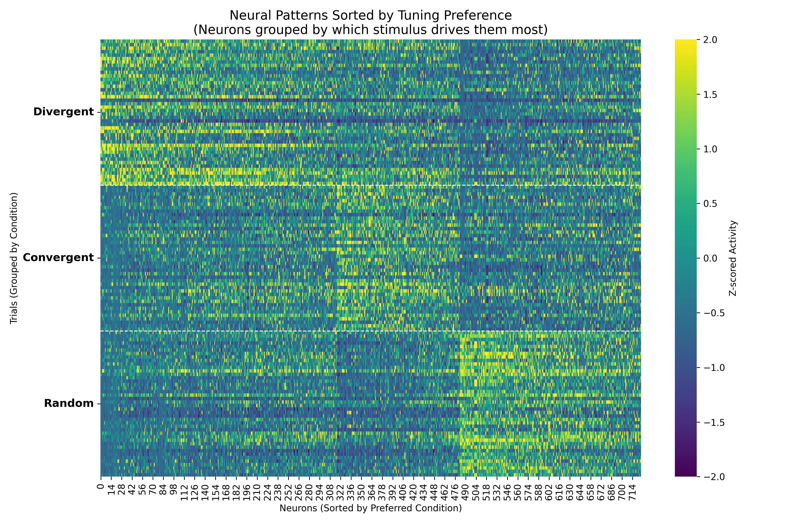
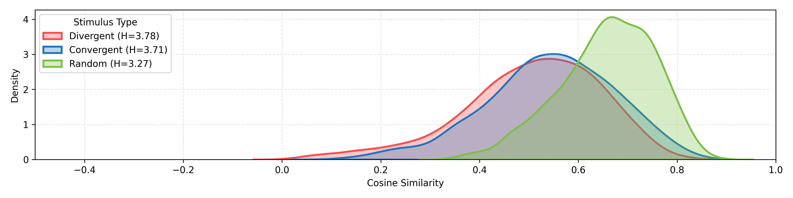
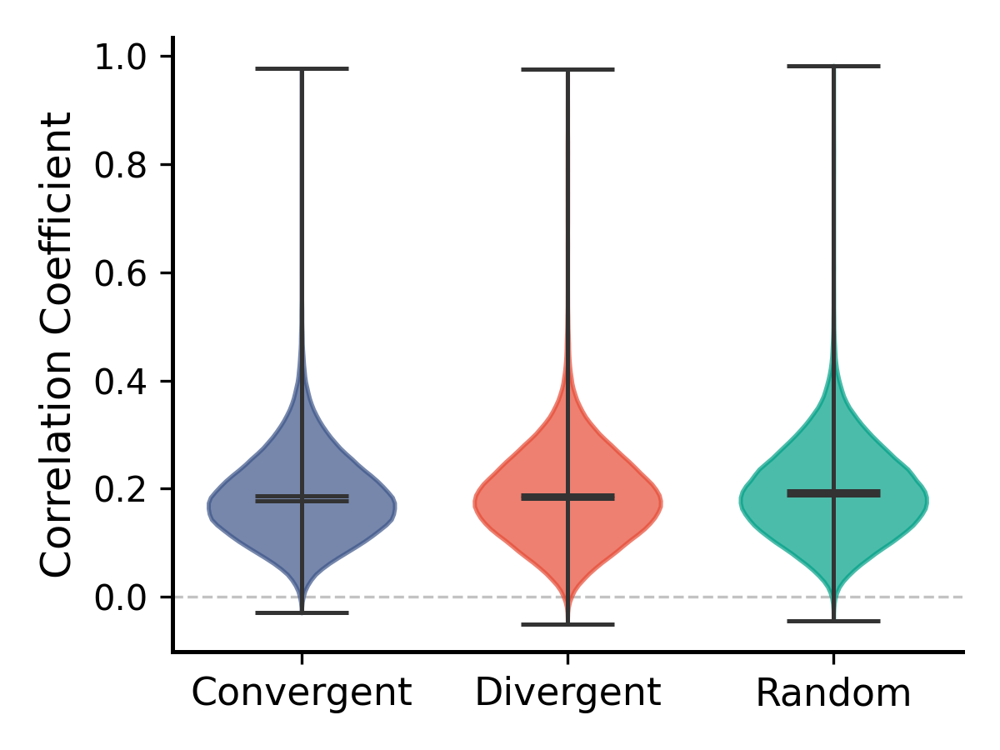
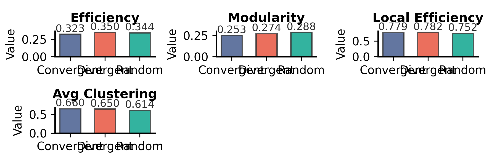

# 小鼠 M78_1017 综合数据分析报告

## 1. 基础元数据
- **原始数据源**: `/beegfs_hdd/data/nfs_share/users/guiyun/nishome/Micedata/M78_1017`
- **分析生成时间**: `2026-03-10 14:25:00`
- **数据导出目录**: `[../results/M78_1017/data/](./data/)` (包含CSV与JSON)
- **图表导出目录**: `[../results/M78_1017/figures/](./figures/)`

---

## 2. 关键结果数据表

### 2.1 网络拓扑核心指标 (Network Metrics)
以下为不同刺激条件下的图论特征统计（详见 `[data/M78_1017_network_metrics.csv](./data/M78_1017_network_metrics.csv)`）：

|   Class_ID |   n_nodes |   n_edges |   density |   mean_degree |   largest_component |   avg_clustering |   global_efficiency |   local_efficiency |   transitivity |   efficiency |   modularity |   betweenness_mean |
|-----------:|----------:|----------:|----------:|--------------:|--------------------:|-----------------:|--------------------:|-------------------:|---------------:|-------------:|-------------:|-------------------:|
|          1 |       726 |     13158 |      0.05 |       36.2479 |                 633 |           0.6597 |              0.3233 |             0.779  |         0.4653 |       0.3233 |       0.2527 |             0.0018 |
|          2 |       726 |     13158 |      0.05 |       36.2479 |                 652 |           0.6498 |              0.3498 |             0.7818 |         0.4082 |       0.3498 |       0.2737 |             0.0018 |
|          3 |       726 |     13158 |      0.05 |       36.2479 |                 646 |           0.614  |              0.3436 |             0.7524 |         0.4115 |       0.3436 |       0.2879 |             0.0018 |

### 2.2 RR 神经元与解码数据
* **RR 神经元索引**: 已将不同类别的响应神经元原位索引导出至 `[JSON文件](../results/M78_1017/data/M78_1017_rr_neurons_indices.json)`，可用于后续特征追踪。
* **时间窗解码准确率**: 各时间点的分类表现及打乱基线数据已导出至 `[CSV文件](../results/M78_1017/data/M78_1017_decoding_accuracy.csv)`。

---

## 3. 核心可视化图表
*(注：以下图片链接指向本地 `./figures/` 目录。必须在上方对应的绘图函数中添加 `fig.savefig()` 以生成这些文件)*

### 3.1 RR 神经元空间分布

### 3.2 群体平均响应时间序列 (Population Average)

### 3.3 动态分类准确率 (Decoding Accuracy)

[0.40555556 0.41666667 0.43888889 0.47222222 0.41666667 0.36666667
 0.33333333 0.33888889 0.37222222 0.43333333 0.46666667 0.83333333
 0.92222222 0.90555556 0.95       0.93888889 0.96666667 0.96111111
 0.97222222 0.98888889 0.97222222 0.97777778 0.96666667 0.98888889
 0.98333333 0.98333333 0.96111111 0.97777778 0.97222222 0.97777778
 0.97777778 0.97777778 0.96666667 0.95555556 0.96666667 0.97777778
 0.94444444 0.92777778 0.9        0.87777778 0.86666667 0.87222222
 0.82222222 0.82777778 0.73333333 0.70555556 0.71111111 0.63333333
 0.57222222 0.55555556]
[4.21270858e-02 7.08197155e-02 9.50146188e-02 5.19674637e-02
 7.08197155e-02 9.89918316e-02 6.51446633e-02 7.70802051e-02
 6.97216689e-02 6.39492469e-02 6.02207872e-02 5.89255651e-02
 6.02207872e-02 3.16715396e-02 2.32405563e-02 3.04290310e-02
 3.04290310e-02 1.52145155e-02 3.40206909e-02 1.52145155e-02
 1.96418550e-02 3.62177911e-02 2.32405563e-02 1.52145155e-02
 2.48451997e-02 2.48451997e-02 3.72677996e-02 2.32405563e-02
 1.24126708e-16 1.24225999e-02 1.24225999e-02 1.24225999e-02
 1.24225999e-02 2.48451997e-02 3.04290310e-02 2.32405563e-02
 3.92837101e-02 3.16715396e-02 4.64811126e-02 8.00270016e-02
 3.62177911e-02 4.64811126e-02 2.48451997e-02 4.56435465e-02
 6.08580619e-02 9.33763129e-02 1.08653373e-01 6.33430792e-02
 1.01303236e-01 6.80413817e-02]

### 3.4 神经元活动响应聚类 (Clustermap)

   

### 3.5 变量相关性与网络指标提琴图 (Violin/Bars)

