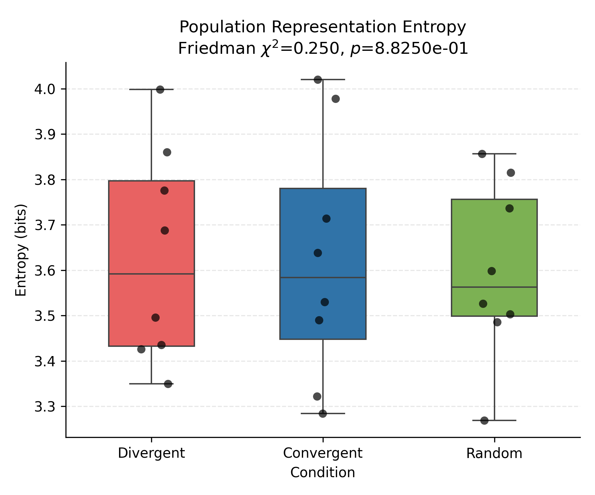
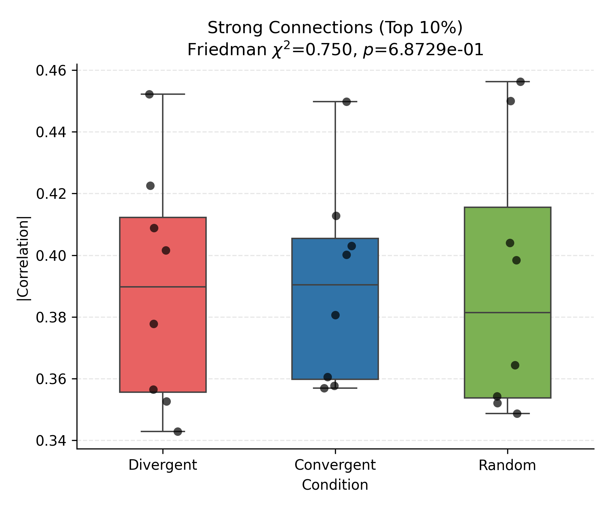
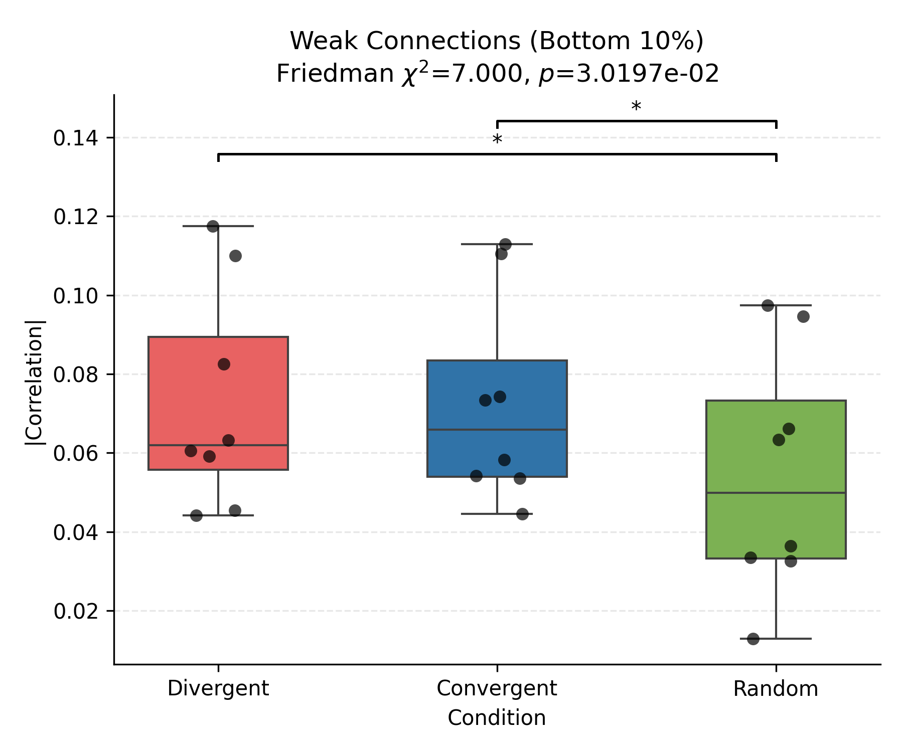
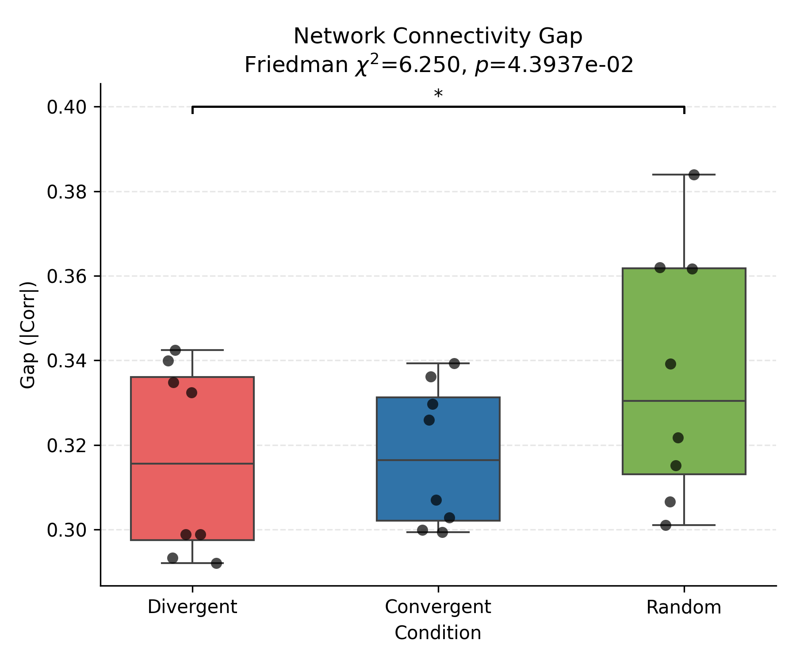
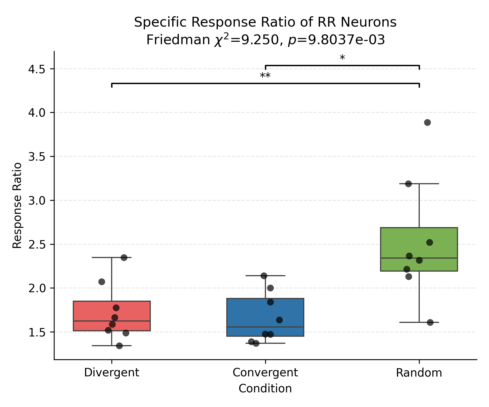

# 多小鼠综合显著性分析报告 (Group-level Analysis)

**总计包含小鼠数量**: 8 只
**纳入数据集**: M21_1107, M77_1031, M71_1024, M73_1128, M79_1128, M78_1017, M91_1017, M77_1107

## 1. 组水平描述性统计 (Mean ± SEM)

| Condition   | Entropy         | Mean_RSM_Sim    | Strong_Correlation   | Weak_Correlation   | Strong_Weak_Gap   | Participants_Ratio   |
|:------------|:----------------|:----------------|:---------------------|:-------------------|:------------------|:---------------------|
| Convergent  | 3.6221 ± 0.0968 | 0.5701 ± 0.0109 | 0.3902 ± 0.0115      | 0.0727 ± 0.0092    | 0.3175 ± 0.006    | 1.6652 ± 0.1043      |
| Divergent   | 3.6286 ± 0.0834 | 0.5561 ± 0.02   | 0.3894 ± 0.0136      | 0.0728 ± 0.0099    | 0.3166 ± 0.008    | 1.724 ± 0.1179       |
| Random      | 3.5989 ± 0.0692 | 0.6264 ± 0.0181 | 0.391 ± 0.0154       | 0.0546 ± 0.0109    | 0.3364 ± 0.0107   | 2.5279 ± 0.2484      |

## 2. 统计检验结果 (Friedman Test & Wilcoxon post-hoc)

| 评估指标 | 主效应 (Friedman) | Divergent vs Convergent | Divergent vs Random | Convergent vs Random |
| :--- | :--- | :--- | :--- | :--- |
| **群体表征熵 (Entropy)** | Friedman $\chi^2$=0.250, $p$=8.8250e-01 | p=0.9453 (ns) | p=0.9453 (ns) | p=0.9453 (ns) |
| **表征相似度 (RSM Mean)** | Friedman $\chi^2$=7.000, $p$=3.0197e-02 | p=0.3828 (ns) | p=0.0234 (*) | p=0.0234 (*) |
| **强连接均值 (Strong Correlation)** | Friedman $\chi^2$=0.750, $p$=6.8729e-01 | p=0.5469 (ns) | p=0.6406 (ns) | p=0.5469 (ns) |
| **弱连接均值 (Weak Correlation)** | Friedman $\chi^2$=7.000, $p$=3.0197e-02 | p=1.0000 (ns) | p=0.0156 (*) | p=0.0234 (*) |
| **网络连接强度差 (Strong-Weak Gap)** | Friedman $\chi^2$=6.250, $p$=4.3937e-02 | p=0.7422 (ns) | p=0.0391 (*) | p=0.0547 (ns) |
| **特异性响应比例 (Participants Ratio)** | Friedman $\chi^2$=9.250, $p$=9.8037e-03 | p=0.6406 (ns) | p=0.0078 (**) | p=0.0156 (*) |

*(注: ns = 不显著, * $p < 0.05$, ** $p < 0.01$, *** $p < 0.001$)*

## 3. 组间对比可视化

### 群体表征熵

### 强连接均值 (Top 10%)

### 弱连接均值 (Bottom 10%)

### 网络强弱连接差

### RR神经元特异性响应比例

