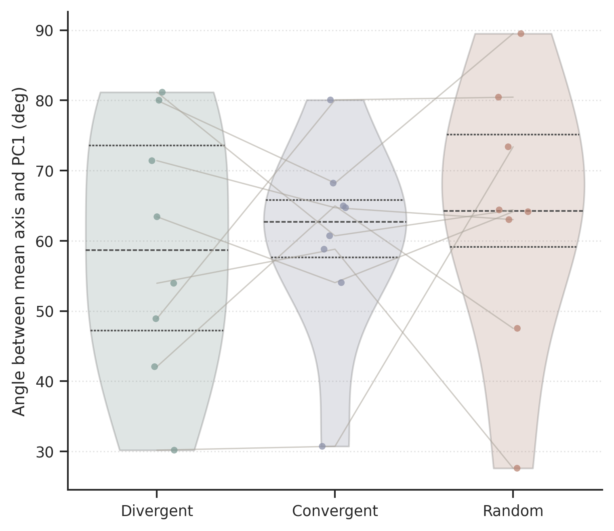
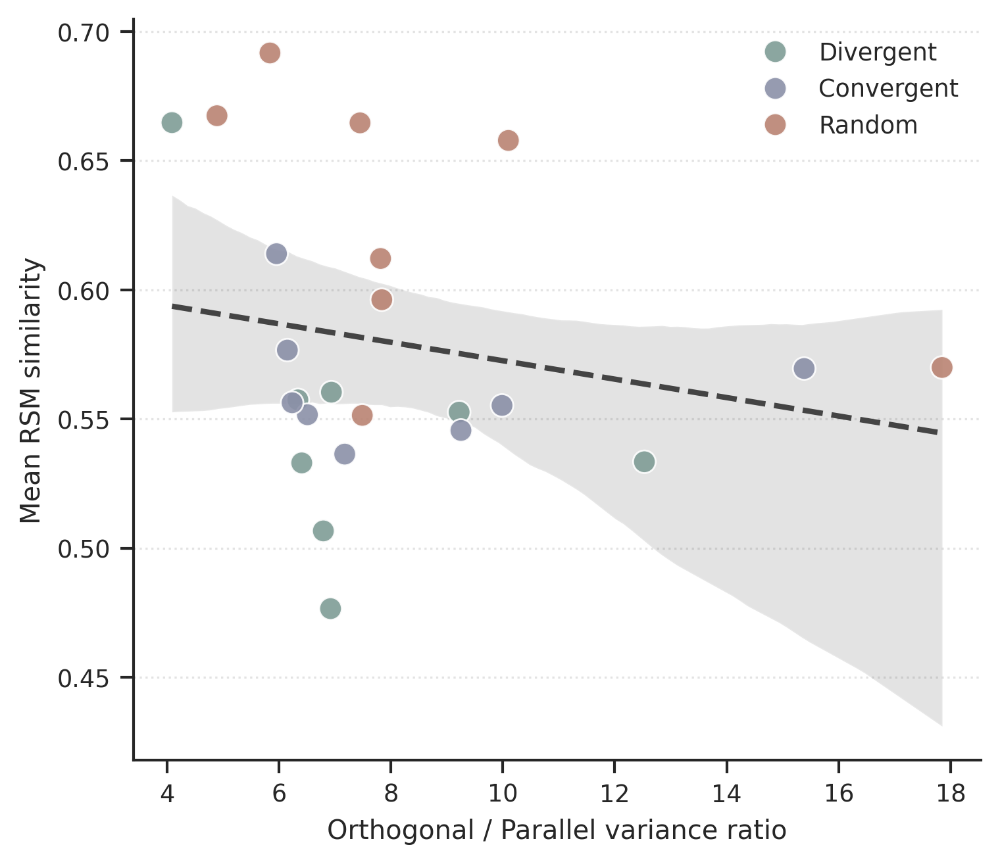
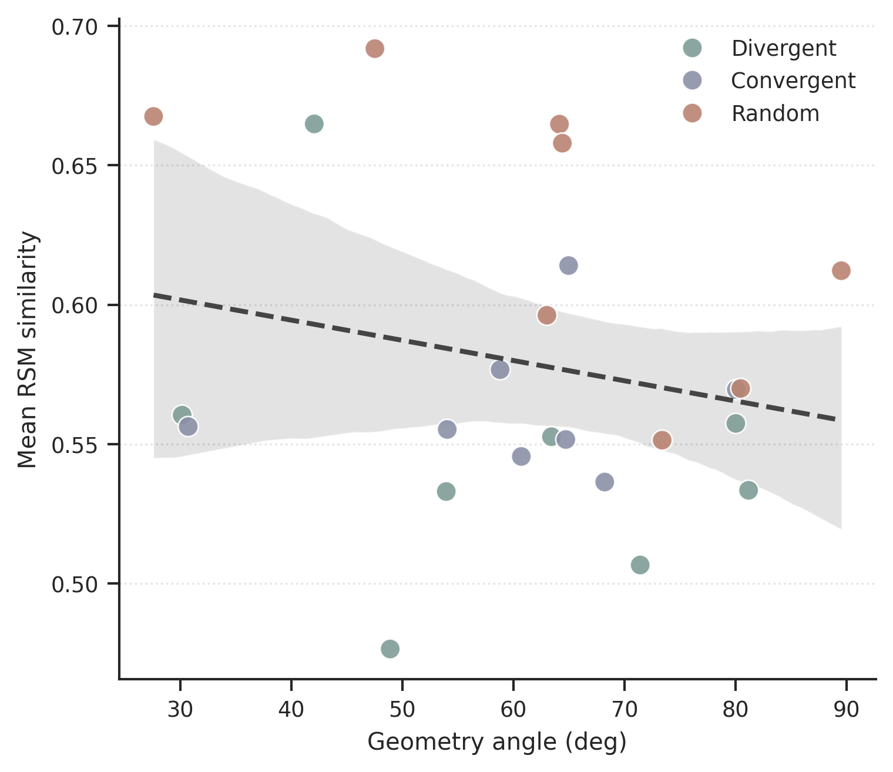
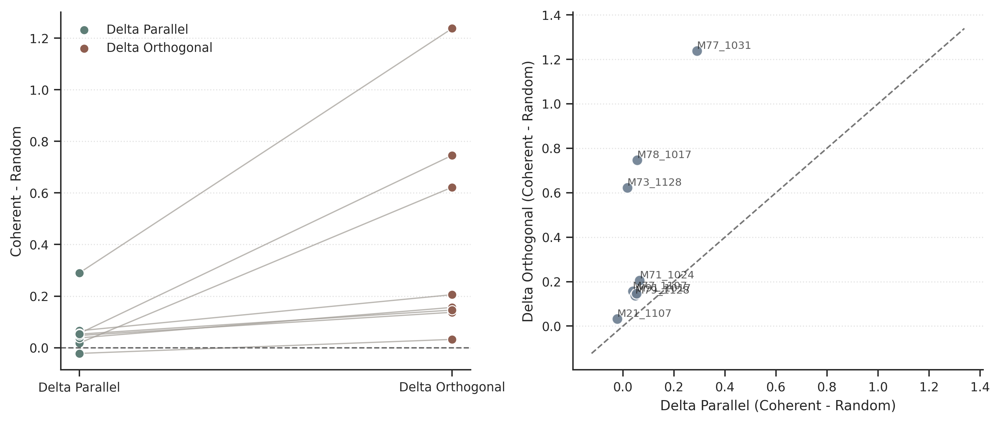

# Group Geometry Analysis Report

**Number of mice**: 8

## Condition summary (mean +/- sem)

| Condition   |   ('angle_deg', 'mean') |   ('angle_deg', 'sem') |   ('orth_parallel_ratio', 'mean') |   ('orth_parallel_ratio', 'sem') |   ('var_parallel', 'mean') |   ('var_parallel', 'sem') |   ('var_orthogonal', 'mean') |   ('var_orthogonal', 'sem') |   ('Mean_RSM_Sim', 'mean') |   ('Mean_RSM_Sim', 'sem') |
|:------------|------------------------:|-----------------------:|----------------------------------:|---------------------------------:|---------------------------:|--------------------------:|-----------------------------:|----------------------------:|---------------------------:|--------------------------:|
| Convergent  |                 60.2802 |                 5.018  |                            8.3311 |                           1.1397 |                     0.2136 |                    0.0299 |                       1.8895 |                      0.4204 |                     0.5632 |                    0.0085 |
| Divergent   |                 58.8909 |                 6.4785 |                            7.4047 |                           0.8813 |                     0.2589 |                    0.0633 |                       1.9508 |                      0.5028 |                     0.5481 |                    0.0194 |
| Random      |                 63.7571 |                 6.821  |                            8.6589 |                           1.4195 |                     0.1682 |                    0.0215 |                       1.5099 |                      0.3225 |                     0.6264 |                    0.0181 |

## Condition tests

| metric              | main_effect                           |     p_main |   Divergent_vs_Convergent |   Divergent_vs_Random |   Convergent_vs_Random |
|:--------------------|:--------------------------------------|-----------:|--------------------------:|----------------------:|-----------------------:|
| angle_deg           | Friedman $\chi^2$=0.75, $p$=6.873e-01 | 0.687289   |                  1        |              0.640625 |              0.640625  |
| orth_parallel_ratio | Friedman $\chi^2$=0.75, $p$=6.873e-01 | 0.687289   |                  0.546875 |              0.945312 |              0.640625  |
| var_parallel        | Friedman $\chi^2$=7.00, $p$=3.020e-02 | 0.0301974  |                  0.945312 |              0.078125 |              0.015625  |
| var_orthogonal      | Friedman $\chi^2$=9.25, $p$=9.804e-03 | 0.00980366 |                  0.945312 |              0.015625 |              0.0078125 |
| anisotropy_index    | Friedman $\chi^2$=0.75, $p$=6.873e-01 | 0.687289   |                  0.546875 |              0.546875 |              1         |

## Mixed models

| model_name   | formula                                                 | term                |   beta |   p_value |   aic |   bic |   n_obs |   n_mice | note                        |
|:-------------|:--------------------------------------------------------|:--------------------|-------:|----------:|------:|------:|--------:|---------:|:----------------------------|
| M1           | Mean_RSM_Sim ~ angle_deg                                | angle_deg           |    nan |       nan |   nan |   nan |      24 |        8 | fit failed: Singular matrix |
| M2           | Mean_RSM_Sim ~ orth_parallel_ratio                      | orth_parallel_ratio |    nan |       nan |   nan |   nan |      24 |        8 | fit failed: Singular matrix |
| M3           | Mean_RSM_Sim ~ Participants_Ratio + angle_deg           | Participants_Ratio  |    nan |       nan |   nan |   nan |      24 |        8 | fit failed: Singular matrix |
| M3           | Mean_RSM_Sim ~ Participants_Ratio + angle_deg           | angle_deg           |    nan |       nan |   nan |   nan |      24 |        8 | fit failed: Singular matrix |
| M4           | Mean_RSM_Sim ~ Participants_Ratio + orth_parallel_ratio | Participants_Ratio  |    nan |       nan |   nan |   nan |      24 |        8 | fit failed: Singular matrix |
| M4           | Mean_RSM_Sim ~ Participants_Ratio + orth_parallel_ratio | orth_parallel_ratio |    nan |       nan |   nan |   nan |      24 |        8 | fit failed: Singular matrix |
| A1           | angle_deg ~ Participants_Ratio                          | Participants_Ratio  |    nan |       nan |   nan |   nan |      24 |        8 | fit failed: Singular matrix |
| A2           | orth_parallel_ratio ~ Participants_Ratio                | Participants_Ratio  |    nan |       nan |   nan |   nan |      24 |        8 | fit failed: Singular matrix |
| D1           | Mean_RSM_Sim ~ Effective_Dim_PR                         | Effective_Dim_PR    |    nan |       nan |   nan |   nan |      24 |        8 | fit failed: Singular matrix |
| D2           | Mean_RSM_Sim ~ angle_deg + Effective_Dim_PR             | angle_deg           |    nan |       nan |   nan |   nan |      24 |        8 | fit failed: Singular matrix |
| D2           | Mean_RSM_Sim ~ angle_deg + Effective_Dim_PR             | Effective_Dim_PR    |    nan |       nan |   nan |   nan |      24 |        8 | fit failed: Singular matrix |
| D3           | Mean_RSM_Sim ~ orth_parallel_ratio + Effective_Dim_PR   | orth_parallel_ratio |    nan |       nan |   nan |   nan |      24 |        8 | fit failed: Singular matrix |
| D3           | Mean_RSM_Sim ~ orth_parallel_ratio + Effective_Dim_PR   | Effective_Dim_PR    |    nan |       nan |   nan |   nan |      24 |        8 | fit failed: Singular matrix |

## Orthogonal-vs-Parallel Expansion Test

Per-mouse deltas are computed as Coherent(mean of Divergent/Convergent) - Random.

### Per-mouse delta table

| mouse_id   |   parallel_coherent_mean |   parallel_random |   delta_parallel_coherent_minus_random |   orthogonal_coherent_mean |   orthogonal_random |   delta_orthogonal_coherent_minus_random |   delta_diff_orth_minus_parallel |   delta_ratio_orth_over_parallel |
|:-----------|-------------------------:|------------------:|---------------------------------------:|---------------------------:|--------------------:|-----------------------------------------:|---------------------------------:|---------------------------------:|
| M21_1107   |                 0.102508 |         0.124594  |                             -0.0220863 |                   0.641927 |            0.609712 |                                0.0322146 |                        0.0543009 |                         -1.45858 |
| M71_1024   |                 0.282295 |         0.21658   |                              0.0657149 |                   1.89822  |            1.6927   |                                0.205515  |                        0.1398    |                          3.12738 |
| M73_1128   |                 0.225931 |         0.208132  |                              0.0177988 |                   2.17221  |            1.55028  |                                0.621926  |                        0.604127  |                         34.9419  |
| M77_1031   |                 0.45756  |         0.1677    |                              0.28986   |                   4.23031  |            2.99294  |                                1.23737   |                        0.947513  |                          4.26886 |
| M77_1107   |                 0.118427 |         0.0804719 |                              0.0379546 |                   0.78697  |            0.630736 |                                0.156235  |                        0.11828   |                          4.11635 |
| M78_1017   |                 0.312645 |         0.257394  |                              0.0552509 |                   3.34514  |            2.59946  |                                0.745674  |                        0.690423  |                         13.4961  |
| M79_1128   |                 0.233138 |         0.185728  |                              0.0474103 |                   1.52825  |            1.39097  |                                0.137279  |                        0.0898691 |                          2.89556 |
| M91_1017   |                 0.157633 |         0.10484   |                              0.0527926 |                   0.758234 |            0.612237 |                                0.145996  |                        0.0932038 |                          2.76547 |

### Group-level paired test summary

|   n_mice |   mean_delta_parallel |   mean_delta_orthogonal |   mean_delta_diff_orth_minus_parallel |   median_delta_diff_orth_minus_parallel |   paired_wilcoxon_p_two_sided |   paired_wilcoxon_p_one_sided_orth_greater |   onesample_diff_p_two_sided |   onesample_diff_p_one_sided_greater |   onesample_delta_orth_p_one_sided_greater |   onesample_delta_parallel_p_one_sided_greater |
|---------:|----------------------:|------------------------:|--------------------------------------:|----------------------------------------:|------------------------------:|-------------------------------------------:|-----------------------------:|-------------------------------------:|-------------------------------------------:|-----------------------------------------------:|
|        8 |              0.068087 |                0.410277 |                               0.34219 |                                 0.12904 |                     0.0078125 |                                 0.00390625 |                    0.0078125 |                           0.00390625 |                                 0.00390625 |                                      0.0117188 |

## Figures

### Angle between mean axis and PC1 (deg)

### Orthogonal / Parallel variance ratio

### Geometry angle (deg)

### Orth-vs-Parallel expansion (Coherent - Random)

